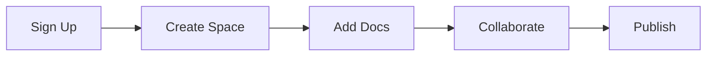

## Overview

Orbit Media Studios empowers you to create, organize, and manage all your project documentation in one centralized space. You get a flexible platform that scales with your teams, from small projects to enterprise workflows. Focus on content while Orbit handles search, versioning, and collaboration features.

This documentation space serves as your hub for learning how to set up spaces, author content, integrate with tools, and customize your experience. Start by exploring key features below, then follow the quick start guide to launch your first documentation site.

<Callout kind="tip">
  Customize your docs with the brand color `#3B82F6` for headers, buttons, and accents to match Orbit Media Studios branding.
</Callout>

## Key Features

Orbit Media Studios offers powerful tools to streamline your documentation process. Here are the core benefits:

<Columns cols={3}>
  <Card title="Organized Spaces" icon="book-open" href="/spaces">
    Create unlimited documentation spaces for projects, teams, or products. Nested folders keep everything structured.
  </Card>
  <Card title="Real-time Collaboration" icon="users" href="/collaboration">
    Invite team members, @mention contributors, and track changes with version history.
  </Card>
  <Card title="Advanced Search" icon="search" href="/search">
    Full-text search across all docs with filters for spaces, tags, and authors.
  </Card>
</Columns>

<Columns cols={2}>
  <Card title="Custom Themes" icon="palette" href="/themes">
    Apply your brand colors like `#3B82F6` and custom fonts without code.
  </Card>
  <Card title="API Integrations" icon="zap" href="/api">
    Embed dynamic content and automate workflows via REST API.
  </Card>
</Columns>

## Quick Start

Get up and running in minutes. Follow these steps to create your first documentation space.

<Steps>
  <Step title="Sign Up" icon="user-plus">
    Visit https://dashboard.orbitmedia.com and create a free account. Verify your email to unlock full features.
  </Step>
  <Step title="Create a Space" icon="plus">
    Click "New Space" and name it for your project, like "My Project Docs".
  </Step>
  <Step title="Add Your First Doc" icon="file-text">
    Create a new page with Markdown or rich text editor. Use the preview to check formatting.
  </Step>
  <Step title="Publish and Share" icon="share-2">
    Set permissions, generate a public link, or embed in your site.
  </Step>
</Steps>

## Quick Navigation

Access core sections quickly:

<Tabs>
  <Tab title="Web Dashboard" icon="monitor">
    Log in at https://dashboard.orbitmedia.com to manage spaces and users.
  </Tab>
  <Tab title="API Reference" icon="code">
    Integrate programmatically. Example request:
    
    <CodeGroup tabs="JavaScript,cURL">
      ```javascript
      const response = await fetch('https://api.orbitmedia.com/v1/spaces', {
        headers: {
          'Authorization': `Bearer ${YOUR_API_KEY}`
        }
      });
      const spaces = await response.json();
      console.log(spaces);
      ```
      ```bash
      curl -H "Authorization: Bearer YOUR_API_KEY" \
           https://api.orbitmedia.com/v1/spaces
      ```
    </CodeGroup>
  </Tab>
</Tabs>

## Brand Guidelines

Follow these guidelines to maintain consistency:

- **Primary Color**: `#3B82F6` – Use for primary buttons, links, and headers.
- **Typography**: Sans-serif fonts like Inter or system defaults.
- **Icons**: Lucide icon set for all UI elements.

<Expandable title="Advanced Customization" default-open="false">
  Override CSS variables in your theme settings:
  
  ```css
  :root {
    --brand-primary: #3B82F6;
    --brand-secondary: #1E40AF;
  }
  ```
</Expandable>

## Next Steps

Ready to dive deeper?

<Columns cols={3}>
  <Card title="Quickstart Guide" icon="zap" href="/quickstart">
    Detailed setup for your first full site.
  </Card>
  <Card title="Authentication" icon="shield" href="/authentication">
    Secure your spaces with API keys and SSO.
  </Card>
  <Card title="Advanced Guides" icon="book-open" href="/guides">
    Embed videos, custom components, and more.
  </Card>
</Columns>

